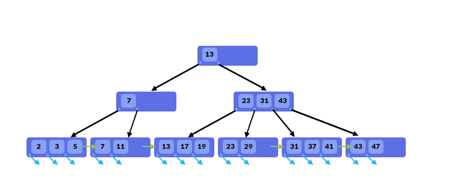
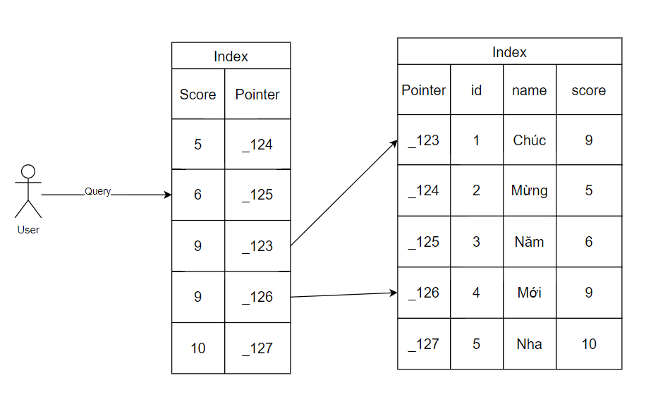
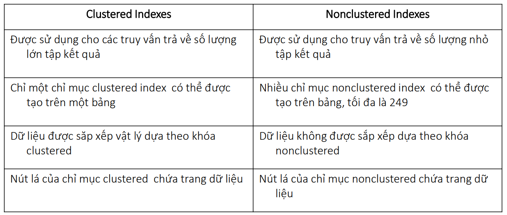

# I. Index là gì ?

`Index` là một cơ chế tối ưu hóa dùng để cải thiện hiệu suất 🐎 truy vấn trong cở sở dữ liệu. Index giúp tăng tốc độ 🐎
truy vấn bằng cách tạo ra một cấu trúc dữ liệu bổ sung dùng để định vị và truy cập nhanh nhất vào dữ liệu trong các bảng
Database.

Ví dụ: Chúng ta có một bảng `student(id, name, score)` lưu thông tin sinh viên, ta muốn lấy ra thông tin các sinh viên
theo khoảng điểm thì sẽ truy vấn SQL như sau:

```sql
SELECT *
FROM student
WHERE score > 8;
```

Vấn đề: Truy vấn sẽ phải quét toàn bộ bảng `student` đó để so sánh và lấy ra những bản ghi thỏa mãn. Cũng giống như việc
lặp một List Student và kiểm tra score > số điểm cần tìm vậy. Vì vậy khi số lượng sinh viên lên đến hàng triệu hay thậm
chí là nhiều hơn 😱 thì việc này sẽ trở nên rất rất chậm và tốn nhiều chi phí 🤕.

Tác dụng của Index: Index sẽ giúp giải quyết vấn đề trên bằng việc định vị các dòng dữ liệu thỏa mãn điều kiện bằng cách
trỏ tới địa chỉ của dữ liệu tương ứng với điều kiện đó 🥱. Nó tương tự như việc chúng ta đánh số trang cho một quyển
sách vậy, chúng ta chỉ cần lật đến số trang có nội dung cần luôn mà không cần phải lật từng trang một cho đến khi tìm
đến nội dung đó.

# II. Ưu nhược điểm của Index

### Ưu điểm

- Một Index cho phép chương trình tìm dữ liệu trong bảng mà không cần quét toàn bộ bảng.
- Index giúp làm tăng tốc độ thực thi các truy vấn cần nối nhiều bảng hay cần sắp xếp dữ liệu.
- Một Index hợp lý có thể cải thiện sự thực thi cơ sở dữ liệu bởi giảm bớt thời gian truy cập.

### Nhược điểm

- Các bảng có các Index đòi hỏi nhiều dung lượng bộ nhớ hơn trong Database.
- Các lệnh thao tác dữ liệu đòi hỏi nhiều thời gian xử lý hơn, vì chúng cần cập nhật sự thay đổi tới các Index. Điều này
  sẽ dẫn đến việc thêm (_có thể bao gồm sửa và xóa_) bản ghi trở nên chậm hơn

# III. Cấu trúc và cách hoạt động của Index

Tùy theo Database mà cấu trúc Index của nó sẽ khác nhau, nhưng thường thì sẽ giống nhau hoặc cũng không có sự khác biệt
quá lớn. Ở bài viết này chúng ta sẽ nói về MySQL thôi nha =)). MySQL cung cấp 3 cấu trúc khác nhau bao gồm: B-Tree, Hash
và R-Tree index.

- R-Tree index được sử dụng cho các loại dữ liệu hình học không gian Spatial data.
- Việc lựa trọn cấu trúc Index còn phụ thuộc vào Storage Engine. Thường thì khi sử dụng MySQL chúng ta sẽ dùng InnoDB mà
  nó chỉ hỗ trợ B-Tree

=> Nên mình chỉ tìm hiểu B-Tree thôi nhé 😁

Chi tiết về mấy cái này thì mọi người tự tìm hiểu thêm nha 😁 tại vì nó thuộc về phần cấu trúc dữ liệu rồi 🥹

### B-Tree



- Dữ liệu index được tổ chức và lưu trữ theo dạng tree, tức là có root, branch, leaf.
- Hiểu một cách đơn giản thì B-Tree là một kiểu cấu trúc dữ liệu tree gồm các node, giá trị của các node được tổ chức
  tăng dần từ trái qua phải, mỗi node chứa 2 thứ là: `Index Key` và `Disk Address` tương ứng của nó.
- Khi truy vấn dữ liệu thì Database sẽ không scan dữ liệu trên toàn bộ bảng để tìm dữ liệu, việc tìm kiếm trong B-Tree
  là 1 quá trình đệ quy, bắt đầu từ root node và tìm kiếm tới branch và leaf, đến khi tìm được tất cả dữ liệu – thỏa mãn
  với điều kiện truy vấn thì mới dùng lại.
- B-Tree index được sử dụng trong các biểu thức so sánh dạng: =, >, >=, <, <=, BETWEEN và LIKE. ⇒ Có thể tối ưu tốt cho
  câu lệnh ORDER BY.

### Cách CSDL biết những trường khác trong bảng sẽ trả về

Index chỉ lưu trữ các giá trị và con trỏ, vậy làm như thế nào mà khi truy vấn chúng ta vẫn có các trường dữ liệu khác
của hàng tương ứng đó?

Các Index Database sẽ lưu trữ các con trỏ đơn giản là thông tin tham chiếu về vị trí của thông tin bổ sung trong bộ nhớ.
Về cơ bản, index chứa score địa chỉ của sinh viên cụ thể đó trên đĩa bộ nhớ. Index thực sự sẽ trông như thế này:


Với Index ở trên, truy vấn chỉ có thể tìm kiếm các hàng trong `score` cột có giá trị = `9` và sau đó sử dụng con trỏ của
nó để đi vào bảng để tìm hàng cụ thể nơi con trỏ đó tồn tại. Sau đó, truy vấn có thể đi vào bảng để truy xuất các trường
theo các cột được yêu cầu cho hàng đáp ứng các điều kiện.

### Tóm tắt

- Index là một cấu trúc dữ liệu bao gồm các cột cho các điều kiện tìm kiếm và một con trỏ. Con trỏ này là địa chỉ trên
  đĩa nhớ của hàng dữ liệu còn lại.
- Cấu trúc dữ liệu Index được sắp xếp để tối ưu hóa hiệu suất truy vấn.
- Truy vấn tìm kiếm một hàng cụ thể trong Index. Index trỏ đến con trỏ, từ đó tìm thấy thông tin còn lại.
- Chỉ mục giảm số lượng hàng mà truy vấn phải tìm kiếm từ 5 xuống còn 2.

# IV. Phân loại Index

### Clustered Index

- Clustered Index là chỉ mục duy nhất trên mỗi bảng sử dụng khóa chính để tổ chức dữ liệu trong bảng. Nó đảm bảo rằng
  khóa chính được lưu trữ theo thứ tự tăng dần, đó cũng là thứ tự mà bảng giữ trong bộ nhớ.

### Non-Clustered Index

- Non-Clustered Index là các tham chiếu được sắp xếp cho một trường cụ thể từ bảng chính và nó chứa các con trỏ chỉ về
  mục gốc ở bảng chính. Ví dụ ở trên là một chỉ mục không phân cụm.

### So sánh:



# V. Demo

Lý thuyết nhiêu đó là đủ rồi 😂. Bây giờ mình sẽ đi vào demo 😁

Tạo table và dữ liệu test

```sql
CREATE TABLE `student`
(
    `id`    int NOT NULL AUTO_INCREMENT,
    `name`  varchar(100) CHARACTER SET utf8 COLLATE utf8_general_ci DEFAULT NULL,
    `score` int                                                     DEFAULT NULL,
    PRIMARY KEY (`id`)
) ENGINE=InnoDB DEFAULT CHARSET=utf8mb3;
```

```sql
CREATE PROCEDURE create_data()
BEGIN
  DECLARE
i INT DEFAULT 100;

  WHILE
i < 100000 DO
    INSERT INTO student (name, score) VALUES (CONCAT("Test-", i), FLOOR(RAND() * 10) + 1);
    SET
i = i + 1;
END WHILE;
END

CALL create_data();
```

## 1. Single Column Index

Tạo Index

```sql
CREATE INDEX idx_score ON student (score) USING BTREE;
```

Xóa Index

```sql
DROP INDEX idx_score ON student;
```

**Sau khi tạo dữ liệu chúng ta sẽ kiểm tra chiến lược thực thi của câu SQL**

### Ví dụ 1: Index là trường Score

```sql
EXPLAIN
ANALYZE
SELECT *
FROM student
WHERE score = 8;
```

Nếu chưa có Index thì khi chạy lệnh trên kết quả sẽ trả về là:

`-> Filter: (s.score = 8)  (cost=10128.83 rows=10013) (actual time=3.007..66.145 rows=10165 loops=1)
-> Table scan on s  (cost=10128.83 rows=100125) (actual time=2.999..58.222 rows=99900 loops=1)
`

- `Filter`:
    - `(s.score > 8)`: Đây là phần filter (bộ lọc) của truy vấn. Nó chỉ ra rằng truy vấn này sử dụng một điều kiện để
      lọc ra các bản ghi trong bảng student với điều kiện score lớn hơn 8.
    - `(cost=10084.75 rows=33372)`: Ước tính chi phí là 10084.75 và số hàng ước tính sẽ được trả về sau khi áp dụng bộ
      lọc là 33372.
    - `(actual time=0.048..35.858 rows=19805 loops=1)`: Thời gian thực tế mà truy vấn mất để thực hiện. Ở đây, thời gian
      bắt đầu (0.048) và thời gian kết thúc (35.858) của truy vấn được hiển thị. Số hàng thực tế được trả về sau khi
      thực hiện truy vấn là 19805. Số lần lặp (loops) là 1, có nghĩa rằng truy vấn chỉ được thực hiện một lần.
- `Table scan on s`:  Phần của kế hoạch truy vấn thực tế, cho biết rằng truy vấn đã quét toàn bộ bảng `student` để tìm
  các hàng thỏa mãn điều kiện.

Khi thêm Index vào cột score thì kết quả trả về là:
`-> Index lookup on s using idx_score (score=8)  (cost=1233.25 rows=10165) (actual time=0.364..19.901 rows=10165 loops=1)
`

Ta có thể thấy chi phí và thời gian thực hiện đã giảm đi rất nhiều sau khi sử dụng Index.

Tuy nhiên hãy thử với câu truy vấn này:

```sql
EXPLAIN
ANALYZE
SELECT *
FROM student
WHERE score > 6;
```

Thì kết quả trả về lại là:
`-> Filter: (student.score > 6) (cost=10235.37 rows=50062) (actual time=0.767..62.192 rows=40016 loops=1)
-> Table scan on student  (cost=10235.37 rows=100125) (actual time=0.760..55.178 rows=99900 loops=1)
`

Với kết quả trên thì rõ ràng là nó đang quét toàn bộ bảng và không sử dụng Index. Tại sao?

Điều này là do trình tối ưu của MySQL sẽ tự động lựa chọn chiến lược thực thi tốt nhất. MySQL phân tích và cho rằng việc
thực hiện quét chỉ mục sẽ không hiệu quả bằng việc quét toàn bộ bảng.

=> Nếu có nhiều hàng có `score > 6` thì việc sử dụng Index thực sự có thể kém hiệu quả hơn. Ví dụ: nếu 90% bản ghi
có `score > 6` thì trình tối ưu hóa truy vấn sẽ phải quét khoảng 90% nút lá của Index và sau đó đọc ít nhất 90% của bảng
để lấy dữ liệu thực tế, điều này sẽ đòi hỏi đọc nhiều dữ liệu từ đĩa hơn là chỉ việc quét bảng.

Để kiểm chứng điều này mọi người có thể thử với câu truy vấn sau (Hint Index sử dụng FORCE INDEX hoặc USE INDEX) để bắt
buộc MySQL sử dụng Index:

```sql
EXPLAIN
ANALYZE
SELECT *
FROM student FORCE INDEX (idx_score)
WHERE score > 6;
```

Kết quả sẽ
là: `-> Index range scan on student using idx_score, with index condition: (student.score > 6)  (cost=37604.09 rows=49980) (actual time=2.178..164.649 rows=39958 loops=1)`

Chúng ta có thể thấy chi phí để thực hiện khi sử dụng Index là rất cao => MySQL sẽ tự động lựa chọn chiến lược tối ưu
nhất (thường thì nếu dữ liệu > 20%, 30% thì MySQL sẽ ưu tiên quét full bảng).

### Ví dụ 2: Index là trường Name

```sql
EXPLAIN
ANALYZE
SELECT *
FROM student
WHERE name LIKE '%Test-123%';
```

Kết quả khi có
Index: `-> Filter: (student.name like '%Test-123%')  (cost=10084.75 rows=11124) (actual time=0.127..56.273 rows=111 loops=1)
-> Table scan on student  (cost=10084.75 rows=100125) (actual time=0.068..31.552 rows=99900 loops=1)
`. Vẫn là quét full bảng điều này là do phần keyword điều kiện có ký tự % ở trước. Điều này giống như việc tra cứu mà
không biết từ khóa bắt đầu bằng chữ cái nào thì sẽ không tra được.

```sql
EXPLAIN
ANALYZE
SELECT *
FROM student
WHERE name LIKE 'Test-123%';
```

Kết quả khi có
Index: `-> Index range scan on student using idx_name, with index condition: (student. name like 'Test-123%')  (cost=50.21 rows=111) (actual time=0.173..0.196 rows=111 loops=1)
`

```sql
EXPLAIN
ANALYZE
SELECT *
FROM student
WHERE name LIKE 'Test%';
```

Kết quả khi có
Index: `-> Filter: (student. name like 'Test%')  (cost=10084.75 rows=50062) (actual time=0.034..43.723 rows=99900 loops=1)
-> Table scan on student  (cost=10084.75 rows=100125) (actual time=0.031..30.711 rows=99900 loops=1)
`. Tại sao lại vẫn quét full bảng? Mọi người suy nghĩ và tự trả lời cái này xem nha 😁.

```sql
EXPLAIN
ANALYZE
SELECT *
FROM student
WHERE UPPER(name) = 'Test-11745';
```

Kết quả khi có
Index: `-> Filter: (upper(student.name) = 'TEST-11745')  (cost=10280.70 rows=99917) (actual time=13.546..65.849 rows=1 loops=1)
-> Table scan on student  (cost=10280.70 rows=99917) (actual time=2.508..46.208 rows=99900 loops=1)
`. Trường hợp này vẫn sẽ quét full bảng do chúng ta dùng hàm SQL, và giá trị sẽ không khớp với Index nên sẽ không nhận
được.

- Để giải quyết thì mình có thể xử lý ở code để upper lên trước.
- Hoặc tạo Function-Based Index upper name

```sql
ALTER TABLE student
    ADD INDEX functional_idx_upper_name((UPPER(name)));
```

=> Không phải khi nào sử dụng Index cũng nhận. Ví dụ như `%` ở trên, hoặc sử dụng một số hàm của SQL sẽ không nhận
Index. Để biết hết mấy cái này thì phải tích lũy theo thời gian và kinh nghiệm nửa :v

## 2. Composite Index/Multi Column Index

Trong thực tế không phải khi nào chúng ta cũng sẽ sử dụng Index trên một cột mà có thể sẽ là nhiều cột một lúc để tối ưu
câu truy vấn với nhiều điều kiện ở nhiều trường khác nhau

Tạo Index

```sql
CREATE INDEX idx_score_name ON student (score, `name`) USING BTREE;
```

Xem Index trong bảng

```sql
SHOW
INDEX FROM student;
```

- Tuy nhiên khi sử dùng Index với nhiều cột mà chúng ta chỉ WHERE chỉ với một cột trong Index đó thì thứ tự được tạo
  cũng sẽ ảnh hưởng đến chiến lược thực thi

Ví dụ:

```sql
EXPLAIN
ANALYZE
SELECT *
FROM student
WHERE name = 'TEST-11745';
```

Chúng ta có thể kiểm tra với câu truy vấn trên với Index sau:

```sql
CREATE INDEX idx_score_name ON student (score, `name`) USING BTREE;
```

Kết quả sẽ là: `-> Filter: (student.name = 'TEST-11745')  (cost=3016.75 rows=9996) (actual time=2.333..2.339 rows=1 loops=1)
-> Index range scan on student using index_for_skip_scan(idx_score_name)  (cost=3016.75 rows=9996) (actual time=2.331..2.336 rows=1 loops=1)
`

Và với Index sau:

```sql
CREATE INDEX idx_name_score ON student (`name`, score) USING BTREE;
```

Kết quả sẽ
là: `-> Index lookup on student using idx_name_score (name='TEST-11745')  (cost=1.10 rows=1) (actual time=0.026..0.026 rows=0 loops=1)
`

Từ 2 kết quả trên chúng ta có thể thấy, thứ tự các cột khi tạo Index sẽ ảnh hưởng đến chiến lược thực thi của câu truy
vấn, chi phí giảm đi gần 3000 lần và thời gian cũng giảm đi đáng kể :v

Khi tạo Index với `name` ở đầu nó sẽ sử dụng giải thuật Index lookup, còn với `name` ở sau nó sử dụng giải thuật Index
range scan và Index skip scan để bỏ qua các cột trong Index.

## Tóm tắt:

- Khi thực hiện chiến lược thực thi sẽ có các giải thuật phổ biến sau:
    - Table scan on ...: Quét toàn bộ bảng để tìm ra các hàng thỏa mãn điều kiện
    - Index scan on ...: Quét toàn bộ Index
    - Index lookup: Sử dụng Index truy cập dữ liệu bằng một giá trị duy nhất, truy vấn trực tiếp hàng chứa giá trị cần
      tìm. Nó được sử dụng cho biểu thức điều kiện `=`
    - Index range scan: Sử dụng Index truy cập dữ liệu với một phạm vi hoặc khoảng giá trị Index khớp với điều kiện truy
      vấn. Nó được sử dụng cho các biểu thức điều kiện là `>, >=, <, <=, LIKE, BETWEEN`
    - Index skip scan: Sử dụng Composite Index truy cập dữ liệu không phải cột đầu tiên của Composite Index.
    - ...
- Khi kết quả truy vấn trả về > 20%, 30% số lượng bản ghi của bảng thì Database sẽ ưu tiên quét toàn bộ bảng.
- Sử dụng Index cần tránh các trường hợp sử dụng một số hàm SQL hoặc một số trường hợp đặc biệt khác sẽ không thực hiện
  được Index.
- Khi tạo Composite Index nhưng không tạo riêng Single Column Index và điều kiện truy vấn chỉ có một cột thì cần chú ý
  đến thứ tự cột trong Composite Index vì nó sẽ ảnh hưởng tới kết quả của chiến lược thực thi.
- Có thể sử dụng Hint Index để yêu cầu truy vấn thực hiện Index. Tuy nhiên cần phải kiểm soát được nó.

# VI. Sử dụng Index một cách hiệu quả • Không phải Index nào cũng nhanh

- Nên tạo Index trên các cột khi:
    - Bảng chứa dữ liệu lớn
    - Cột được sử dụng để tìm kiếm thường xuyên
    - Cột được sử dụng để sắp xếp dữ liệu
    - Dữ liệu trong cột có sự phân biệt cao
- Không nên tạo Index trên các cột khi:
    - Bảng chỉ chứa một vài hàng
    - Cột thường xuyên có thao tác thêm sửa xóa
    - Cột có sự trùng lặp dữ liệu cao
    